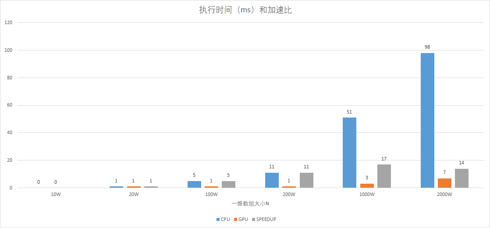
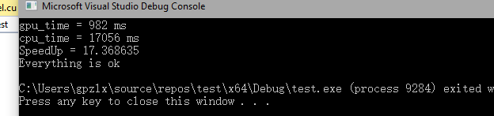

[TOC]

#	《并行计算》上机报告--MPI实验

* 姓名：龚平
* 学号：PB17030808
* 日期：2019-5-24

## 实验环境

- CPU：`Intel i5-8300HQ`
- GPU:  `nVidia GeForce 1050Ti`
- 内存：`DDR4 2666Hz 16GB`
- 操作系统：`Windows 10 1809`
- 软件平台：
  - `Windows SDK Version: 10.0.17134.0`
  - `Platform Toolset: Visual Studio 2017 - Windows XP (v141_xp)`
  - `CUDA Toolkit Version: CUDA10.1`

##	一、算法设计与分析

###	题目

1. 向量加法

   向量加法。定义A，B两个一维数组，编写GPU程序将A和B对应的项相加，将结果存在数组C中。分布测试数组的规模为10W、20W、100W、1000W、2000W时其与CPU加法运行时间之比。

2. 矩阵乘法

   定义A，B两个二维数组。使用GPU实现矩阵乘法。并对比串行程序，给出加速比。

   

###	算法设计

####	题目一

主要时编写一个简单的GPU kernel程序。

```c
__global__ void add(int *a, int *b, int *c) {
	int tid = blockDim.x * blockIdx.x + threadIdx.x;
	int step = blockDim.x * gridDim.x;
	while (tid < N) {
		c[tid] = a[tid] + b[tid];
		tid += step;
	}
}
```

#### 题目二

设A * B = C

GPU编写矩阵乘法为了提高效率，采用分块矩阵乘法。

按C进行划分，对A按行取, 对B按列取。

如图，同时使用share memory来减小访存延迟。其中一个小方格是一个BLOCK，可能含有多个元素，每个元素由一个线程计算。


###	算法分析

#### 题目一

不需要分析吧，因为根本没有算法。

#### 题目二

对结果矩阵C按块划分，块中的每个元素计算都单独由一个线程来完成。

有两个特征：

1. 采用share memory来获取A、B中block信息，减少对global memory的访问
2. 每个线程将中间结果写入直接的local memory， 最终在写入C

由于对share memory的访问基本没有延迟（相对于global memory），所以实际访存开销大概为二读一写，对A、B中的元素都进行一次读访存，对C中的元素进行一次写访存。


##	二、核心代码

###	题目一

```c
///////////////GPU///////////////////////////////
__global__ void add(int *a, int *b, int *c) {
	int tid = blockDim.x * blockIdx.x + threadIdx.x;
	int step = blockDim.x * gridDim.x;
	while (tid < N) {
		c[tid] = a[tid] + b[tid];
		tid += step;
	}
}
/////////////////CPU////////////////////////////
void cpu_add(int *a, int *b, int *c)
{
	for (int i = 0; i < N; i++)
		c[i] = a[i] + b[i];
}
```

###	题目二

```c
//////////////////////////GPU/////////////////////////
__device__  float * GetSubMatrix(float *matrix, int m, int index, int width)
{
	return  matrix + width * BLOCK_SIZE*index + BLOCK_SIZE * m;
}

__global__ void matrix_mul_gpu(float *C, float * A, float *B, int wA, int hA, int wB)
{
	__shared__ float As[BLOCK_SIZE][BLOCK_SIZE];
	__shared__ float Bs[BLOCK_SIZE][BLOCK_SIZE];

	int bx = blockIdx.x;
	int by = blockIdx.y;

	int tx = threadIdx.x;
	int ty = threadIdx.y;

	float Csub = 0;
	int end = wA / BLOCK_SIZE;
	for (int m = 0; m < end; m++)
	{
		float *subA = GetSubMatrix(A, m, by, wA);
		float *subB = GetSubMatrix(B, bx, m, wB);
		As[ty][tx] = *(subA + wA * ty + tx);
		Bs[ty][tx] = *(subB + wB * ty + tx);

		__syncthreads();

		for (int k = 0; k < BLOCK_SIZE; ++k)
			Csub += As[ty][k] * Bs[k][tx];

		__syncthreads();
	}

	float *subC = GetSubMatrix(C, bx, by, wB);
	*(subC + wB * ty + tx) = Csub;
}
//////////////////////////CPU//////////////////////////
void matrix_mul_cpu(float *C, float *A, float *B)
{
	for (int i = 0; i < HC; i++)
		for (int j = 0; j < WC; j++)
		{
			float sum = 0;
			for (int k = 0; k < WA; k++)
				sum += A[i * WA + k] * B[k * WB + j];
			C[i * WC + j] = sum;
		}
}

```

##	三、结果与分析

###	题目一



GPU单个thread的运算能力比CPU thread弱很多，在运算量不大的情况下，反而是CPU更快。

但是随着运算量的增加，GPU高吞吐量的优势可以得到充分发挥。

最终GPU相比CPU运行可以实现十倍以上的加速比。

###	题目二



BLOCKSIZE: `16 * 16 = 256`

矩阵规模

* `A: 100 * 100 * BLOCK = 256 00 00`
* `B: 100 * 100 * BLOCK = 256 00 00`
* `C: 100 * 100 * BLOCK = 256 00 00`

由于数组规模开的足够大，所以可以充分发挥GPU优势，加速比等于17

##	总结

本次实验在计算量不大的时候，CPU算的快，在计算量大的时候，GPU算的快。

这个现象可以用Ni & Sum定律解释。

由于GPU并行程度比CPU高大的多，为了达到甚至超过CPU的效率就必须增加任务量。

不过随着近来，随着科学计算、机器学习等学科的发展，运算量越来越大，越来越能发挥出GPU的优势（另一方面，也是GPU高算力促进了这些学科的发展）。

但GPU编程也有非常大的挑战：

1. GPU编程更考研并行编程能力以及对GPU结构的了解程度
2. GPU编程调试、debug、优化不是非常方便（一旦写的不好，效率特别低）
3. GPU控制单元过于简单，不适合控制流非常复杂的应用。

## 	源码

最好移步`github` [gpzlx1/parallel_computing_lab/gpu](https://github.com/gpzlx1/parallel_computing_lab/tree/master/gpu)
