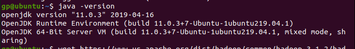
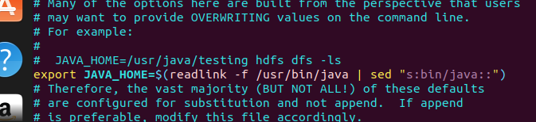
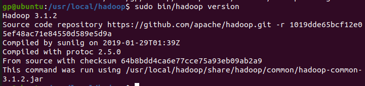
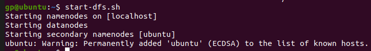
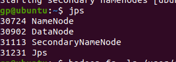
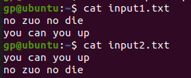
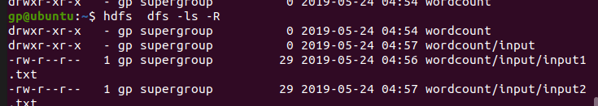
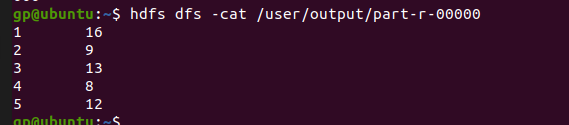

[TOC]

#	《并行计算》上机报告--MapReduce实验

* 姓名：龚平
* 学号：PB17030808
* 日期：2019-5-31

## 实验环境

- CPU：`Intel i5-8300HQ`
- 内存：`DDR4 2666Hz 16GB`
- 操作系统：`Ubuntu 19.04`
- 软件平台：
  - `Java SKD 11.0.3`
  - `Hadoop 3.1.2`

##	一、算法设计与分析

###	题目

1. 按照Hadoop安装运行说明文档中的指导自己搭建伪分布式Hadoop环境，熟悉HDFS的常用操作（参考 Hdoop实战 第31-36页），运行WordCount程序，得到统计结果。请详细写出你每一步的操作，最好有截图，最后的结果部分必须有截图。

2. 实现一个统计输入文件中各个长度的单词出现频次的程序。

   

###	算法设计

####	题目一

没有算法

#### 题目二

根据所给的example（WordCount.java）程序，大致可以知道MapReduce大致分为两步，map和reduce。要完成统计输入文件中各个长度的单词出现频次的程序，只需改变Map规则即可。

###	算法分析

#### 题目一

母鸡啊

#### 题目二

母鸡啊


##	二、核心代码

###	题目一

example实验

```java
import java.io.IOException;
import java.util.StringTokenizer;

import org.apache.hadoop.conf.Configuration;
import org.apache.hadoop.fs.Path;
import org.apache.hadoop.io.IntWritable;
import org.apache.hadoop.io.Text;
import org.apache.hadoop.mapreduce.Job;
import org.apache.hadoop.mapreduce.Mapper;
import org.apache.hadoop.mapreduce.Reducer;
import org.apache.hadoop.mapreduce.lib.input.FileInputFormat;
import org.apache.hadoop.mapreduce.lib.output.FileOutputFormat;
import org.apache.hadoop.util.GenericOptionsParser;

public class WordCount {

  public static class TokenizerMapper 
       extends Mapper<Object, Text, Text, IntWritable>{
    
    private final static IntWritable one = new IntWritable(1);
    private Text word = new Text();
      
    public void map(Object key, Text value, Context context
                    ) throws IOException, InterruptedException {
      StringTokenizer itr = new StringTokenizer(value.toString());
      while (itr.hasMoreTokens()) {
        word.set(itr.nextToken());
        context.write(word, one);
      }
    }
  }
  
  public static class IntSumReducer 
       extends Reducer<Text,IntWritable,Text,IntWritable> {
    private IntWritable result = new IntWritable();

    public void reduce(Text key, Iterable<IntWritable> values, 
                       Context context
                       ) throws IOException, InterruptedException {
      int sum = 0;
      for (IntWritable val : values) {
        sum += val.get();
      }
      result.set(sum);
      context.write(key, result);
    }
  }

  public static void main(String[] args) throws Exception {
    Configuration conf = new Configuration();
    String[] otherArgs = new GenericOptionsParser(conf, args).getRemainingArgs();
    if (otherArgs.length != 2) {
      System.err.println("Usage: wordcount <in> <out>");
      System.exit(2);
    }
    Job job = new Job(conf, "word count");
    job.setJarByClass(WordCount.class);
    job.setMapperClass(TokenizerMapper.class);
    job.setCombinerClass(IntSumReducer.class);
    job.setReducerClass(IntSumReducer.class);
    job.setOutputKeyClass(Text.class);
    job.setOutputValueClass(IntWritable.class);
    FileInputFormat.addInputPath(job, new Path(otherArgs[0]));
    FileOutputFormat.setOutputPath(job, new Path(otherArgs[1]));
    System.exit(job.waitForCompletion(true) ? 0 : 1);
  }
}
```

###	题目二

更改Map规则

```java
import java.io.IOException;
import java.util.StringTokenizer;

import org.apache.hadoop.conf.Configuration;
import org.apache.hadoop.fs.Path;
import org.apache.hadoop.io.IntWritable;
import org.apache.hadoop.io.Text;
import org.apache.hadoop.mapreduce.Job;
import org.apache.hadoop.mapreduce.Mapper;
import org.apache.hadoop.mapreduce.Reducer;
import org.apache.hadoop.mapreduce.lib.input.FileInputFormat;
import org.apache.hadoop.mapreduce.lib.output.FileOutputFormat;
import org.apache.hadoop.util.GenericOptionsParser;
public class WordLengthCount {

  public static class TokenizerMapper
       extends Mapper<Object, Text, Text, IntWritable>{

    private final static IntWritable one = new IntWritable(1);
    private Text word = new Text();

    public void map(Object key, Text value, Context context
                    ) throws IOException, InterruptedException {
      StringTokenizer itr = new StringTokenizer(value.toString());
      while (itr.hasMoreTokens()) {
        String tmp = itr.nextToken();
        word.set(Integer.toString(tmp.length()));  //对单词长度进行映射
        context.write(word, one);
      }
    }
  }

  public static class IntSumReducer
       extends Reducer<Text,IntWritable,Text,IntWritable> {
    private IntWritable result = new IntWritable();

    public void reduce(Text key, Iterable<IntWritable> values,
                       Context context
                       ) throws IOException, InterruptedException {
      int sum = 0;
      for (IntWritable val : values) {
        sum += val.get();
      }
      result.set(sum);
      context.write(key, result);
    }
  }

  public static void main(String[] args) throws Exception {
    Configuration conf = new Configuration();
    String[] otherArgs = new GenericOptionsParser(conf, args).getRemainingArgs();
    if (otherArgs.length != 2) {
      System.err.println("Usage: wordlengthcount <in> <out>");
      System.exit(2);
    }
    Job job = new Job(conf, "word length count");
    job.setJarByClass(WordLengthCount.class);
    job.setMapperClass(TokenizerMapper.class);
    job.setCombinerClass(IntSumReducer.class);
    job.setReducerClass(IntSumReducer.class);
    job.setOutputKeyClass(Text.class);
    job.setOutputValueClass(IntWritable.class);
    FileInputFormat.addInputPath(job, new Path(otherArgs[0]));
    FileOutputFormat.setOutputPath(job, new Path(otherArgs[1]));
    System.exit(job.waitForCompletion(true) ? 0 : 1);
  }
}
```


##	三、结果与分析

###	题目一

####	实验过程

#####	step1 ssh & sshd

由于是在我的虚拟机上执行，一些基础配置已经设置完毕。

只需执行

```powershell
ssh-copy-id localhostvim
```

就可以实现```ssh localhost```免密钥登录

#####	step2 jdk

由于所给的jdk和hadoop过于成旧，所以打算重新下载最新的jdk和hadoop进行实验

安装jdk

```powershell
sudo apt install default-jdk
```

验证安装成功

```powershell
java -version
```




#####	step3 Hadoop

同样从官网下载最新的Hadoop版本

```powershell
wget https://www-us.apache.org/dist/hadoop/common/hadoop-3.1.2/hadoop-3.1.2.tar.gz
```

得到hadoop-3.1.2.tar.gz

解压

```powershell
tar zxvf hadoop-3.1.2.tar.gz #得到hadoop-3.1.2
```

为了方便管理，我解压后的文件夹移到/usr/local下

```powershell
sudo mv hadoop-3.1.2 /usr/local/hadoop
```


#####	step4 配置Hadoop

######	修改hadoop-env.sh

```powershell
sudo vim /usr/local/hadoop/etc/hadoop/hadoop-env.sh
```

在#JAVA_HOME 处添加

```powershell
export JAVA_HOME=$(readlink -f /usr/bin/java | sed "s:bin/java::")
```



检验是否安装成功

```powershell
sudo /usr/local/hadoop/bin/hadoop version
```



配置环境变量

在~/.bashrc文件末增添

```powershell
export HADOOP_HOME=/usr/local/hadoop
export PATH=$HADOOP_HOME/bin:$HADOOP_HOME/sbin:$PATH
```

随后

```powershell
source ~/.bashrc #使其生效
```

######	修改xml文件(伪分布模式)

1. 修改`core-site.xml`文件，内容如下

```xml
<configuration>
    <property>
        <name>fs.defaultFS</name>
        <value>hdfs://localhost:9000</value>
    </property>
</configuration>
```

2. 修改`hdfs-site.xml`文件，内容如下

```xml
<configuration>
    <property>
        <name>dfs.replication</name>
        <value>1</value>
    </property>
</configuration>
```

3. 修改`mapred-site.xml`文件，内容如下

```xml
<configuration>
    <property>
        <name>mapreduce.framework.name</name>
        <value>yarn</value>
    </property>
</configuration>

<configuration>
    <property>
        <name>mapreduce.application.classpath</name>
        <value>$HADOOP_MAPRED_HOME/share/hadoop/mapreduce/*:$HADOOP_MAPRED_HOME/share/hadoop/mapreduce/lib/*</value>
    </property>
</configuration>xxxxxxxxxx18 1<configuration>2    <property>3        <name>dfs.replication</name>4        <value>1</value><configuration>5    <property>6        <name>mapreduce.framework.name</name>7        <value>yarn</value>8    </property>9</configuration>1011<configuration>12    <property>13        <name>mapreduce.application.classpath</name>14        <value>$HADOOP_MAPRED_HOME/share/hadoop/mapreduce/*:$HADOOP_MAPRED_HOME/share/hadoop/mapreduce/lib/*</value>15    </property>16</configuration>17    </property>18</configuration>xml
```

#####	step5 启动Hadoop

######	格式化namenode

```powershell
hdfs namenode -format
```

######	启动namenode

```powershell
start-dfs.sh
```



执行jps命令查看



#####	step 6 执行程序准备

######	HDFS上新建目录

```powershell
hdfs dfs -mkdir /user/gp/wordcount/input
```

如果失败，则手动递归执行

```powershell
hdfs dfs -mkdir /user
hdfs dfs -mkdir /user/gp
hdfs dfs -mkdir /user/gp/wordcount
hdfs dfs -mkdir /user/gp/wordcount/input
```

上传文件到HDFS上

```shell
hdfs dfs -put input1.txt /user/gp/wordcount/input
hdfs dfs -put input2.txt /user/gp/wordcount/input
```

文件内容



检验是否上传成功

```powershell
hdfs dfs -ls -R
```



######	执行程序

准备好WorldCount.java并编译

添加classpath

```powershell
export HADOOP_HOME=/usr/local/hadoop
export CLASSPATH=$($HADOOP_HOME/bin/hadoop classpath):$CLASSPATH
```

编译

```powershell
javac WordCount.java
```

打包

```powershell
jar -cvf WordCount.jar ./WordCount*.class
```

执行

```powershell
hadoop jar WordCount.jar WordCount /user/gp/wordcount/input   /user/gp/wordcount/output
```

查看执行结果

```powershell
hadoop fs -cat /user/gp/wordcount/output/part-r-00000
```


#####	step7 关闭集群

```powershell
stop-dfs.sh
```


###	题目二

我们利用python随机生成我们的测试文件，python代码如下

```python
import random
line = random.randrange(2,12)
for i in range(line):
    world_num = random.randrange(2,5)
    for j in range(world_num):
        world_len = random.randrange(1,6)
        li = []
        for k in range(world_len):
            temp = random.randrange(65,91)
            c = chr(temp)
            li.append(c)
        result = "".join(li)
        print(result, end = ' ')
    print()
```

生成的文件内容

```shell
#input3.txt
JG ELE KNI 
JW EWLJQ Q SK 
G PGS K D 
YBGAU THG GTFAG 
YXSW UUWE BB 
Z AQKLY 
KZ X MRGU HV 
GDVHM G SI 
Z CDJQ 
L SPJ 
QOUTS AKPRM ACP 
#input4.txt
MMK QTV AXU 
QD BVKP MODPD R 
YITHD D 
UZUTX XTM T 
XTMS B 
BRFU W 
HNSGV R 
CRUAX EQ 
V VNX TAP 
JTQM ASD 
```

和实验一类似上传文件和程序并执行

执行结果



经检验实验结果正确

##	总结

初步了解了MapReduce

1. MapReduce是一种分布式计算模型，是Google提出的，主要用于搜索领域，解决海量数据的计算问题。
2. MR有两个阶段组成：Map和Reduce，用户只需实现map()和reduce()两个函数，即可实现分布式计算。

MapReduce执行流程


就使用Hadoop而言还是非常便利的，可以完成数据挖掘的一系列任务，是云计算的重要应用之一。

## 	源码

最好移步`github` [gpzlx1/parallel_computing_lab/mapreduce](https://github.com/gpzlx1/parallel_computing_lab/tree/master/mapreduce)