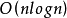
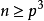
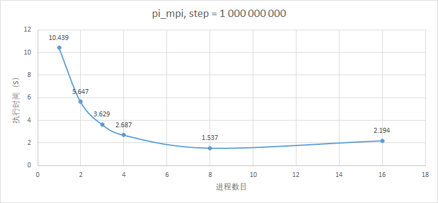
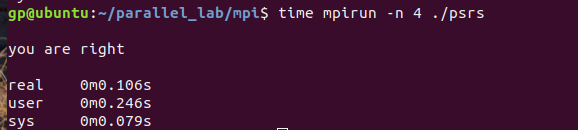
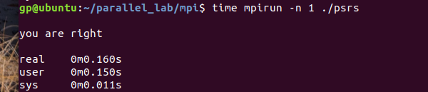

[TOC]

#	《并行计算》上机报告--MPI实验

* 姓名：龚平
* 学号：PB17030808
* 日期：2019-5-6

## 实验环境

- CPU：`Intel i5-8300HQ`
- 内存：`DDR4 2666Hz 16GB`
- 操作系统：`Ubuntu 18.10`
- 软件平台：
  - `gcc (Ubuntu 8.2.0-7ubuntu1) 8.2.0`
  - `MPICH 3.3b2`

##	一、算法设计与分析

###	题目

1. 用MPI编程实现PI的计算。

2. 用MPI实现PSRS排序。


###	算法设计

####	题目一

在本实验中，我们采用`arctanx`的导数在`0~1`上得积分去逼近pi值。可以把`0~1`均匀划分成p段，p个进程各自算自己相应得段，最后所有进程执行一次`reducation`

#### 题目二

PSRS算法步骤：

​	假设有p个进程，有N条数据需要排序。（N = k * p， k是正整数）

1. 均匀划分：将N条数据均匀划分成p段，每个进程处理一段数据。
2. 局部排序：各个进程对各自的数据进行排序。
3. 选取样本：p个进程中，每个进程需要选取出p个样本，选取规则为 $\frac{i \times dataLength}{p}$ ，其中`i=0，2，···，p-1`
4. 样本排序：用一个进程对p个进程的共 p$\times$p 个样本进行排序。
5. 选取主元：一个进程从排好序的样本中抽取 p - 1 个主元。选取方法是 i $\times\\$p，i = 1，2，···，p - 1。
6. 主元划分：p个进程的数据按照p - 1个主元划分为p段。
7. 全局交换：进程 i (i=0,1,$\dots$ p-1)将第 j (j=0,1,…,p−1) 段发送给进程 j。也就是每个进程都要给其它所有进程发送数据段，并且还要从其它所有进程中接收数据段，
8. 归并排序：各个进程对接收到的p个数据进行最终排序，然后写入全局变量result中。


###	算法分析

#### 题目一

利用`arctanx`导数在`0~1`上积分求pi值，算法简单易于实现，但是收敛速度不够快，并且受double精度影响，无法求得非常精确得pi值。

#### 题目二

如果注意到一个好的串行排序算法的时间复杂度为  ，上述PSRS算法的时间复杂度在  时，为  ，其中p为线程数。

这里我们选取的串行排序算法为快速排序，其对随机数列排序效果最好。


##	二、核心代码

###	题目一

```c
#define STEPS 1000000000

	int my_rank;
    int mpi_size;
    MPI_Init(NULL, NULL);
    MPI_Comm_rank(MPI_COMM_WORLD, &my_rank);
    MPI_Comm_size(MPI_COMM_WORLD, &mpi_size);
    
    int length = (STEPS + mpi_size - 1) / mpi_size;
    double step = 1.0 / STEPS;
    double x, local_pi = 0;
    double global_pi;
	//各个进程任务划分
    int my_begin = length * my_rank;
    int my_end = min(length * (my_rank + 1), STEPS);
	//开始计算
    for(int i = my_begin; i < my_end; i++)
    {
        x = ( i + 0.5 ) * step;
        local_pi += 4.0 / (1.0 + x * x);
    }

    local_pi *= step;

    MPI_Barrier(MPI_COMM_WORLD);
	//对local_pi进行全局规约
    MPI_Reduce(&local_pi, &global_pi, 1, MPI_DOUBLE, MPI_SUM, 0, MPI_COMM_WORLD);

    if(my_rank == 0)
        printf("\n pi = %0.15lf\n",global_pi);

    MPI_Finalize();
```


###	题目二

```c
	int DATA_NUM=1000000;
	int datas[1000000];

    int mpi_size;
    int my_rank;

    MPI_Init(NULL, NULL);
    MPI_Comm_rank(MPI_COMM_WORLD, &my_rank);
    MPI_Comm_size(MPI_COMM_WORLD, &mpi_size);
	//step1:均匀划分
    int length = (DATA_NUM + mpi_size - 1) / mpi_size;
    int offset = length * my_rank;
    int local_datas_size = min(length, DATA_NUM - length * my_rank);
    int *local_datas = (int *) malloc (sizeof(int) * local_datas_size);

    int *datas_begin = (int *) malloc(sizeof(int) * mpi_size);
    int *datas_len = (int *) malloc (sizeof(int) * mpi_size);
    if(my_rank == 0)//主进程对数据进行初始化，并准备散播数据
    {
        datas_init(datas);

        for(int i = 0; i < mpi_size - 1; i++)
        {
            datas_begin[i] = i * length;
            datas_len[i] = length;
        }
        datas_begin[mpi_size - 1] = (mpi_size - 1) * length;
        datas_len[mpi_size - 1] = DATA_NUM - (mpi_size - 1) * length;
    }

    MPI_Barrier(MPI_COMM_WORLD);

    MPI_Scatterv(datas, datas_len, datas_begin, MPI_INT, local_datas, 
                    local_datas_size, MPI_INT, 0, MPI_COMM_WORLD);

    free(datas_begin);
    free(datas_len);
    //step2: 局部排序
    qsort(local_datas, local_datas_size, sizeof(int), cmp);
    //step3：选取样本
    int *regular_samples = (int *) malloc (sizeof(int) * mpi_size);
    for(int i = 0; i < mpi_size; i++)
        regular_samples[i] = local_datas[i * local_datas_size / mpi_size];

    MPI_Barrier(MPI_COMM_WORLD); 

    int *global_regular_samples = (int *) malloc (sizeof(int) * mpi_size * mpi_size);
	//将各个进程样本数据发送到主进程
    MPI_Gather(regular_samples, mpi_size, MPI_INT, global_regular_samples, 
                mpi_size, MPI_INT, 0, MPI_COMM_WORLD);

    int *privots = (int *) malloc (sizeof(int) * (mpi_size - 1));

    if(my_rank == 0)
    {
		//step4：样本排序
        qsort(global_regular_samples, mpi_size * mpi_size, sizeof(int), cmp);
        //step5：选取主元
        for(int i = 0; i < mpi_size - 1; i++)
        {
            privots[i] = global_regular_samples[(i+1) * mpi_size];
        }
    }
    free(global_regular_samples);
    free(regular_samples);

    MPI_Barrier(MPI_COMM_WORLD);
	//将选取的主元广播
    MPI_Bcast(privots, mpi_size - 1, MPI_INT, 0, MPI_COMM_WORLD);
	//step5：主元划分
    int *part_start_index = (int *) malloc (sizeof(int) * mpi_size);
    int *part_length = (int *) malloc (sizeof(int) * mpi_size);
    int data_index = 0;
    for(int i = 0; i < mpi_size - 1; i++)
    {
        part_start_index[i] = data_index;
        part_length[i] = 0;

        while((data_index < local_datas_size) && (local_datas[data_index] <= privots[i]))
        {
            data_index++;
            part_length[i]++;
        }
    }
    part_start_index[mpi_size - 1] = data_index;
    part_length[mpi_size - 1] = local_datas_size - data_index;

    free(privots);
    MPI_Barrier(MPI_COMM_WORLD);
  	//step7：全局交换
    int *recv_rank_partlen = (int *) malloc (sizeof(int) * mpi_size);
    MPI_Alltoall(part_length, 1, MPI_INT, recv_rank_partlen, 1, MPI_INT, MPI_COMM_WORLD);

    int rank_partlen_sum = 0;
    int *rank_part_start = (int *) malloc (sizeof(int) * mpi_size);

    for(int i = 0; i < mpi_size; i++)
    {
        rank_part_start[i] = rank_partlen_sum;
        rank_partlen_sum += recv_rank_partlen[i];
    }

    int *recv_part_data = (int *) malloc (sizeof(int) * rank_partlen_sum);

    MPI_Alltoallv(local_datas, part_length, part_start_index, MPI_INT, 
                    recv_part_data, recv_rank_partlen, rank_part_start, MPI_INT, MPI_COMM_WORLD);
	//step8：归并排序
	//各个进程对接收到的数据进行最终排序
    qsort(recv_part_data, rank_partlen_sum, sizeof(int), cmp);

    free(recv_rank_partlen);
    free(rank_part_start);
    MPI_Barrier(MPI_COMM_WORLD);

    int *master_partlen = (int *) malloc (sizeof(int) * mpi_size);
    int *master_data_start = (int *) malloc (sizeof(int) * mpi_size);

    MPI_Gather(&rank_partlen_sum, 1, MPI_INT, master_partlen, 1, MPI_INT, 0, MPI_COMM_WORLD);

    if(my_rank == 0)
    {
        for(int i = 0, temp_sum = 0; i < mpi_size; i++)
            {
                master_data_start[i] = temp_sum;
                temp_sum += master_partlen[i]; 
            }
    }
	//各个进程将最终结果发生到主进程，写入datas
    MPI_Gatherv(recv_part_data, rank_partlen_sum, MPI_INT, 
                    datas, master_partlen, master_data_start, MPI_INT, 0, MPI_COMM_WORLD);

    free(local_datas);
    free(recv_part_data);
    free(master_data_start);
    free(master_partlen);
	//结果校验
    if(my_rank == 0)
    {
        if(datas_check(datas))
            printf("\nyou are right\n");
        else
            printf("\nsomething wrong\n");
    }

    MPI_Finalize();
    return 0;
}
```

##	三、结果与分析

###	题目一

执行结果




（未开编译器优化）随着线程数目得增加，进程数目为8时，计算速度最快。主要原因是我的CPU核心最高为8个逻辑核，当进程过大时，系统调度会反复切换进程，增大上下文切换开销和负载不均衡。

和omp相比，mpi调度单位是进程，并行的粒度更大，开销更多。

###	题目二

这里我们针对`int32`进行排序，排序数据利用`random（）`函数进行初始化。

对`1 000 000`数据进行排序，进程为4时，用时在0.1s



进程为1时，用时为0.16s



加速比不大的原因主要在于运算量不大，并行部分占比太小，受限于amdal定律，无法得到非常高的加速比。


##	总结

相较与`openmp`，`MPI`提供了更为丰富的操作函数，如散播、广播、聚集、全局交换、扫描的，是一种针对分布式存储系统设计的高度成熟的并行语言；但是在共享式存储系统上还是`openmp`并行粒度更细，并行开销更小，可以得到更好的性能优化。


## 	源码

最好移步`github` [gpzlx1/parallel_computing_lab/mpi](https://github.com/gpzlx1/parallel_computing_lab/tree/master/mpi)
