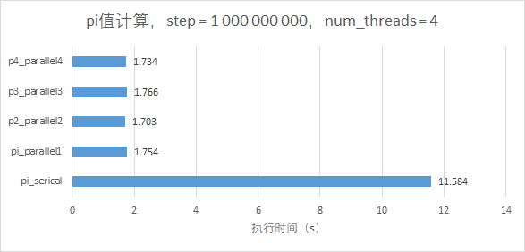
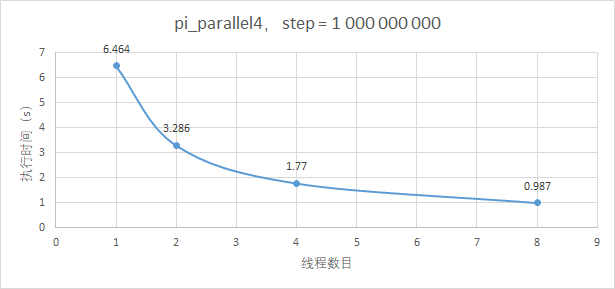
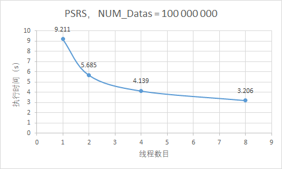
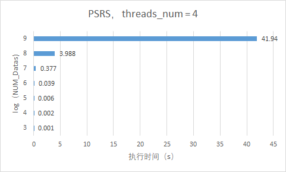

[TOC]

#	《并行计算》上机报告--OpenMP实验

* 姓名：龚平
* 学号：PB17030808
* 日期：2019-4-22

##	实验环境

* CPU：`Intel i5-8300HQ`
* 内存：`DDR4 2666Hz 16GB`
* 操作系统：`Ubuntu 18.10`
* 软件平台：`gcc (Ubuntu 8.2.0-7ubuntu1) 8.2.0`

## 一、算法设计与分析

###	题目

1. 用4种不同并行方式的OpenMP实现π值的计算。

2. 用OpenMP实现PSRS排序。

### 算法设计

####	题目一

针对题目一，相关算法和代码都已给出，并且基本能够运行，但是存在访存模式不佳和计算冗余的问题，所以可以针对相关代码进行一定优化，提升程序性能。

####	题目二

PSRS算法步骤：

​	假设有p个进程，有N条数据需要排序。（N = k * p， k是正整数）

   	1. 均匀划分：将N条数据均匀划分成p段，每个进程处理一段数据。
      	2. 局部排序：各个进程对各自的数据进行排序。
         	3. 选取样本：p个进程中，每个进程需要选取出p个样本，选取规则为 $\frac{i \times dataLength}{p}​$ ，其中`i=0，2，···，p-1`
            	4. 样本排序：用一个进程对p个进程的共 p$\times$p 个样本进行排序。
               	5. 选取主元：一个进程从排好序的样本中抽取 p - 1 个主元。选取方法是 i $\times\\​$p，i = 1，2，···，p - 1。
 	6. 主元划分：p个进程的数据按照p - 1个主元划分为p段。
 	7. 全局交换：进程 i (i=0,1,$\dots​$ p-1)将第 j (j=0,1,…,p−1) 段发送给进程 j。也就是每个进程都要给其它所有进程发送数据段，并且还要从其它所有进程中接收数据段，
 	8. 归并排序：各个进程对接收到的p个数据进行最终排序，然后写入全局变量result中。


###	算法分析

####	题目一

对四个代码优化主要为：增加局部变量`sum_part`替代`sum[id]`进行计算，在并行域快结束时，令`sum[id] = sum_part`，从而减少内存访问，尽可能利用register和caches。

####	题目二

如果注意到一个好的串行排序算法的时间复杂度为  ，上述PSRS算法的时间复杂度在  时，为  ，其中p为线程数。

这里我们选取的串行排序算法为快速排序，其对随机数列排序效果最好。


##	二、核心代码

### 题目一

优化示例

```c
//增加了sum_part局部变量，提高各个线程的访存性能
#pragma omp parallel private(i,x)
    {
        double sum_part = 0;
        int id = omp_get_thread_num();
	    for(i = id; i < STEPS; i+=NUM_THREADS)
        {
	    	x = (i + 0.5) * step;
	    	sum_part += 4.0/(1.0 + x * x);
	    }
        sum[id] = sum_part;
    }
```

其他三个代码类似优化。

###	题目二

```c
	//全局变量
	int datas[1000000000];
	//main函数初始化操作
	int length = NUM_DATA / NUM_THREADS;

	if (length == 0)
		return 0;

	datas_init(datas);

	int regularSamples[NUM_THREADS * NUM_THREADS]; //样本数组
	int privots[NUM_THREADS - 1];  //选取的主元数组
	int partStartIndex[NUM_THREADS * NUM_THREADS]; // 主元划分：每段开始index
	int partLength[NUM_THREADS * NUM_THREADS];  //主元划分：每段的长度
	int tt = 0;

	omp_set_num_threads(NUM_THREADS);
	//程序开始
#pragma omp parallel shared(regularSamples, privots) 
	{
        //step1:均匀划分
		int id = omp_get_thread_num();
		int idStart = id * length;
		int *thread_datas = datas + idStart;
		//step2：局部排序
		qsort(thread_datas, length, sizeof(int), cmp);
		//step3：选取样本
		for (int i = 0; i < NUM_THREADS; i++)
		{
			regularSamples[NUM_THREADS * id + i] = thread_datas[(i * length) / NUM_THREADS];
		}

#pragma omp barrier
        //step4：样本排序
        //step5：选取主元
#pragma omp single 
		{
			qsort(regularSamples, NUM_THREADS * NUM_THREADS, sizeof(int), cmp);
			for (int i = 0; i < NUM_THREADS - 1; i++)  //选取p-1个主元
				privots[i] = regularSamples[(i + 1) * NUM_THREADS];
		}

#pragma omp barrier
        //step6：主元划分
		int dataIndex = 0;
		int anotherIdStart = id * NUM_THREADS;
		for (int i = 0; i < NUM_THREADS - 1; i++)
		{
			partStartIndex[i + anotherIdStart] = dataIndex;
			partLength[i + anotherIdStart] = 0;

			while ((dataIndex < length) && (thread_datas[dataIndex] <= privots[i]))
			{
				dataIndex++;
				(partLength[i + anotherIdStart])++;
			}
		}

		partStartIndex[NUM_THREADS - 1 + anotherIdStart] = dataIndex;
		partLength[NUM_THREADS - 1 + anotherIdStart] = length - dataIndex;

#pragma omp barrier
		//step7：全局交换
		int size = 0;
		for (int i = 0; i < NUM_THREADS; i++)
			size += partLength[id + i * NUM_THREADS]; //每个线程计算自己所需排序数据的长度
		int *temp = (int*)malloc(size * sizeof(int));
		int index;
		int len;
        //取每个进程的段数据
		for (int i = 0, k = 0; i < NUM_THREADS; i++)
		{
			index = partStartIndex[id + i * NUM_THREADS] + i * length;
			len = partLength[id + i * NUM_THREADS];
			for (int j = 0; j < len; j++)
			{
				temp[k++] = datas[index + j];
			}
		}
		//step8：归并排序
		qsort(temp, size, sizeof(int), cmp);
		//将结果顺序写入到datas中
#pragma omp for ordered schedule(static,1)
		for (int t = 0; t < omp_get_num_threads(); ++t)
		{
#pragma omp ordered
			{
				for (int i = 0; i < size; i++)
					datas[tt++] = temp[i];
			}
		}
	}
	//结果检测
	if (datas_check(datas))
		printf("YOU ARE RIGHT\n");
	else
		printf("SOMETHINE WRONG\n");
```

##	三、结果与分析

###	题目一



这里我们可以看出四种pi值的计算方式第二种效果最好，但是总体差距不大。另外，这里看似四种并行方式计算相比串行实现了超线性加速，但是需要指出的是，串行代码未进行彻底的优化。在这种情况下，比较结果是不可靠的。



随着线程数目的增加，程序执行时间越来越短，但是减缓趋势逐渐变慢，在线程数为8时，`speedup = 6.55`。根据amdal定律，$\frac{speedup}{p}\\$​下降主要受程序中串行部分的影响，当然我们也可以通过加大计算量提高$\frac{speedup}{p}\\$。

###	题目二

这里我们针对排序的数据都是`int32`类型



同样，受制于amdal定理，$\frac{speedup}{p}\\$下降主要受程序中串行部分的影响，在8个线程时，`speedup = 2.87`



而当线程数固定，当计算量越来越大，$\frac{speedup}{p}\\$越来越高，接近于1。经过简单计算，PSRS算法的时间复杂度，在  时，近似为  ，其中p为线程数。


##	总结

在本次实验中初步接触了`openMP`编程语言，其只需加上简单的并行编译制导语句就能实现程序并行化，对刚刚接触并行计算的新手非常友好。但是，需要指出的是，在设计和写并行代码时，还是非常需要并行计算思想，尤其是`debug`过程和串行的编程几乎完全不同。


##	源码

最好移步`github` [gpzlx1/parallel_computing_lab/omp](https://github.com/gpzlx1/parallel_computing_lab/tree/master/omp)

